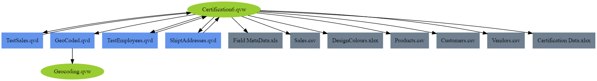

Examples
========

QVD
---
Load the xml header of a qvd file like this::

	from qvstools.blocks import QVD

	qvd_file = r"MyQVD.qvd"
	
	qv = QVD(qvd_file)
	
	"""A few useful items are added as properties of the QVD class."""
	print('Filename: ',qv.filename)
	>>> Filename:  Test.qvd
	
	print('Creator Doc: ',qv.CreatorDoc)
	>>> Creator Doc:  C:\Users\ben.simonds\Documents\QVPythonTools\Qlik-Script-Tools\QVW\GenRandomTables.qvw
	
	print('Created Time: ',qv.CreateUtcTime)
	>>> Created Time:  2016-03-09 12:01:26
	
	print('Fields: ',qv.fields)
	>>> Fields:  ['ID1', 'Category1', 'Value1']
	
	"""And we can search for more in the xml."""
	print('No of Records: ',qv.qvdheader.find('.//NoOfRecords').text)
	>>> No of Records:  1000
	
Blocks
------

Creating a new block library and adding a block::
	
	from qvstools.blocks import *

	bl = BlockLibrary('MyBlockLibrary') #Create a block library.
	bl.add_text_block(
		'MyBlock',							#Name
		'A small block of qlikview script', #Description
		'Block',							#Type
		'Script.qvs'						#Block to be added.
		)

Blocks are just normal qvs script, but you can specify strings to be replaced with the syntax below::

	//(@0,'First Replace String')
	
	//Normal qlik script from here on.
	
	@0:
	Load
		1		as ID
		'Text'	as Text
		10		as Value
	AutoGenerate 1;

You can then write the block to a file with the block.write() method, the replacelist argument accepts a list of items to replace::

	bl.write_block('MyBlock',['MyTable'])

write_block supports the usual python write modes (w or a), but defaults to a to allow you to chain blocks together easily.

The resulting output file::
	
	//Normal qlik script from here on.
	
	MyTable:
	Load
		1		as ID
		'Text'	as Text
		10		as Value
	AutoGenerate 1;

You can save useful blocks into xml files for reapeated use without entering descriptions and names every time::

	bl.block_to_xml('MyBlock')

Blocks can also be created from QVD's::
	
	bl.add_qvd_block('Data.qvd')

Directories can also be batch loaded::
	
	#Load a directory of block xml files
	bl.add_directory_blocks('Directory_Blocks')
	#or QVDs:
	bl.add_directory_QVDs('Directory_QVDs')

PRJ
---

Load a PRJ directory as a python object::

	from qvstools.prj import *
	prj_folder = r"TestPRJ-prj"
	
	prj = PRJ(prj_folder)

Search through the xml file and replace elements with find_replace_elements. Here we replace only caption fonts::

	prj.find_replace_elements(".//CaptionFont/FontName",'Times New Roman')
	prj.find_replace_elements(".//CaptionFont/Bold",'false')

Log
---

Create an instance of the logfile class to parse a logfile::

	from qvstools.log import *

	logfile_path = r"Data\DepsGraph1.qvw.log"
	lf = LogFile(logfile_path)

Get a list of files mentioned in the logfile::

	for f in lf.get_file_lines():
		print(f['file'])

Build a dependency graph of the logfile, in GraphViz dot format::

	with open('Output_Demo6_graphviz.txt','w') as f:
		f.write(generate_graphviz(build_dependency_graph(logfile_path,depth=100)))
		
Example output (once the output is pasted into `GraphViz.it <http://GraphViz.it>`_):

Subbify
-------
Subbify an existing load script with subbify. This can either using python as a module, or with the command-line tool QVSubbify. Here with the command line tool::

	QVSubbify "C:\Users\ben.simonds\Documents\MyScript.qvs"
	
The script can be exported from qlikview, and uses the ///$tab TabName lines that qlik uses to mark tab boundaries to break up the script into separate subroutines. The name of the tab will be assumed to be the name of the table being loaded, so for best results, name your tab after the main table being loaded to allow the metadata subroutine that subbify adds to your script to pick up row and column numbers of your tables. Also, be aware that if the table is dropped before the end of the tab it the metadata subroutine will not pick up row and column numbers. The easiest fix for this is just to edit the script afterwards and move the metadata subroutine calls to before your drop statements.

Subbification can also be done within a python script::
	
	from qvstools.subbify import subbify

	script_file = r"C:\Users\ben.simonds\Documents\MyScript.qvs"

	subbify(script_file)

The result is an automatically generated qlikview application that allows you to run your load script in separate subroutines, and that gathers metadata about your load times and table sizes.

.. image:: img/example_Subbify.png
